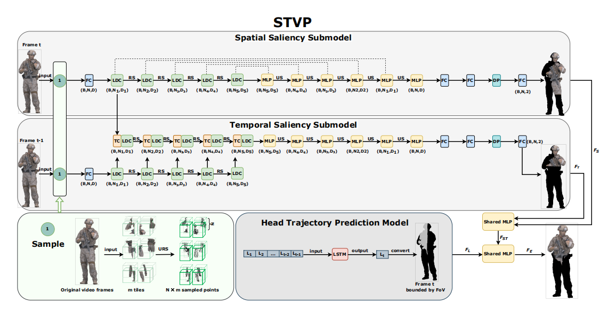

# STVP-main
This is the official implementation of STVP, a simple and efficient neural architecture for viewpoint prediction in 3D point cloud videos. For technical details, please refer to:

Viewport Prediction for Volumetric Video Streaming by Exploring Video Saliency and Trajectory Information. [PaPer](https://arxiv.org/abs/2311.16462)

Jie Li, Zhixin Li, Zhi Liu, Pengyuan Zhou, Richang Hong, Qiyue Li, Han Hu


### Setup Instructions
This implementation has been tested with Python 3.5, TensorFlow 1.11, CUDA 9.0, and cuDNN 7.4.1, running on Ubuntu 18.04.

- 1.Clone the repository 
```
git clone --depth=1 https://github.com/Cedarleigh/STVP-main && cd STVP-main
```
- 2.Setup python environment
```
conda create -n stvp python=3.5
source activate stvp
pip install -r stvp_requirements.txt
```
